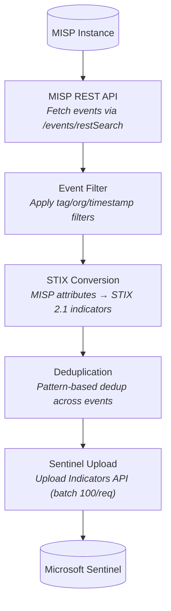
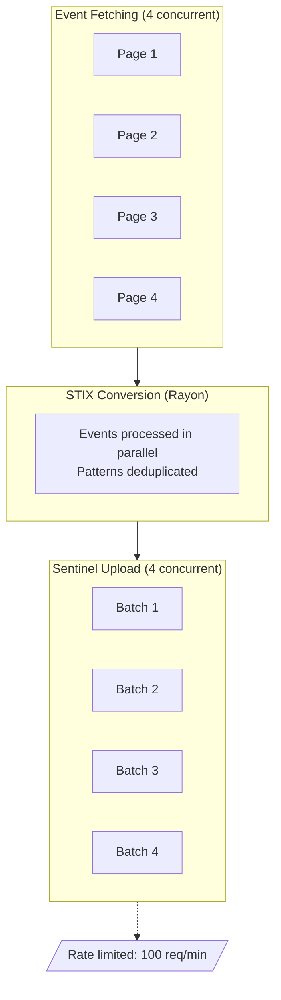

# Architecture

MISP2Sentinel syncs threat intelligence from MISP to Microsoft Sentinel.

## Data Flow



## Components

### misp2sentinel-core

Shared library containing:

- **MispClient**: MISP REST API client with concurrent page fetching
- **SentinelClient**: Sentinel Upload API client with rate limiting
- **Syncer**: Orchestrates fetch → convert → upload pipeline
- **STIX types**: Indicator, AttackPattern, ThreatActor, Identity, Relationship

### misp2sentinel-cli

Command-line tool for local/scheduled sync. Reads config from file or environment.

### misp2sentinel-azure-function

Azure Function with timer and HTTP triggers. Uses managed identity for Sentinel auth.

## STIX Conversion

### Supported Attribute Types

Only attributes with `to_ids=true` are processed.

| MISP Type | STIX Pattern |
|-----------|--------------|
| `ip-src`, `ip-dst` | `[ipv4-addr:value = '...']` or `[ipv6-addr:value = '...']` |
| `ip-src\|port`, `ip-dst\|port` | `[ipv4-addr:value = '...']` (port stripped) |
| `domain`, `hostname` | `[domain-name:value = '...']` |
| `domain\|ip` | `[domain-name:value = '...']` (IP stripped) |
| `url` | `[url:value = '...']` |
| `email-src`, `email-dst` | `[email-addr:value = '...']` |
| `email-subject` | `[email-message:subject = '...']` |
| `filename` | `[file:name = '...']` |
| `mutex` | `[mutex:name = '...']` |
| `regkey`, `regkey\|value` | `[windows-registry-key:key = '...']` |
| `md5`, `sha1`, `sha256`, `sha512` | `[file:hashes.'...' = '...']` |
| `ssdeep`, `imphash`, `authentihash` | `[file:hashes.'...' = '...']` |
| `filename\|md5`, `filename\|sha256`, etc. | `[file:hashes.'...' = '...']` (filename stripped) |

### Tag Mapping

| MISP Tag | STIX Field | Notes |
|----------|------------|-------|
| `tlp:white`, `tlp:clear` | `object_marking_refs` | Uses marking-definition UUID |
| `tlp:green` | `object_marking_refs` | `marking-definition--34098fce-...` |
| `tlp:amber` | `object_marking_refs` | `marking-definition--f88d31f6-...` |
| `tlp:red` | `object_marking_refs` | `marking-definition--5e57c739-...` |
| `sentinel-threattype:*` | `indicator_types` | Custom threat type override |
| All other tags | `labels` | Except internal MISP tags |

Tags excluded from `labels`:
- `tlp:*` (mapped to object_marking_refs)
- `misp-galaxy:*` (internal reference)
- `misp:*` (internal metadata)
- `sentinel-*` (processed separately)
- `Threat-Report` (internal)

## Sentinel API

Uses the Upload Indicators API:

```
POST /workspaces/{id}/threat-intelligence-stix-objects:upload
     ?api-version=2024-02-01-preview

Body: {
  "sourcesystem": "MISP",
  "stixobjects": [...]
}
```

Supported STIX object types: `indicator`, `attack-pattern`, `threat-actor`, `identity`, `relationship`.

Rate limits: 100 objects per request, 100 requests per minute.

## Concurrency Model



## Configuration Hierarchy

```
1. Environment variables (highest priority)
2. Config file (config.toml)
3. Default values
```

Azure Function uses Key Vault for secrets, which are exposed as environment variables.
